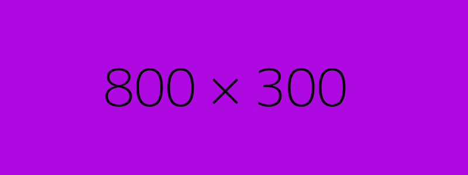

# Why choose us

## <mark style="color:purple;">Why choose us and not them?</mark>&#x20;

<mark style="color:purple;"></mark>

### <mark style="color:purple;">✔️</mark> 1 -> Descrever pontos positivos do Oasis-Swap

### <mark style="color:purple;">✔️</mark> 2 -> Descrever pontos positivos do Oasis-Swap

### <mark style="color:purple;">✔️</mark> 3 -> Descrever pontos positivos do Oasis-Swap

O que acha de adicionar uma imagem em cada ponto positivo vs um negativo de alguma defi conhecida? que passe a ideia?&#x20;

### <mark style="color:purple;">Are you not convinced yet?</mark>

#### Lests think about... (começar a falar o pq dos modelos economicos das outras Defis serem insustentáveis)

## &#x20;                   <mark style="color:purple;">"Come to the purple-side!"</mark>&#x20;

essa frase é legal kk podia ficar numa imagem de fianalização o que acha?

.png>)
